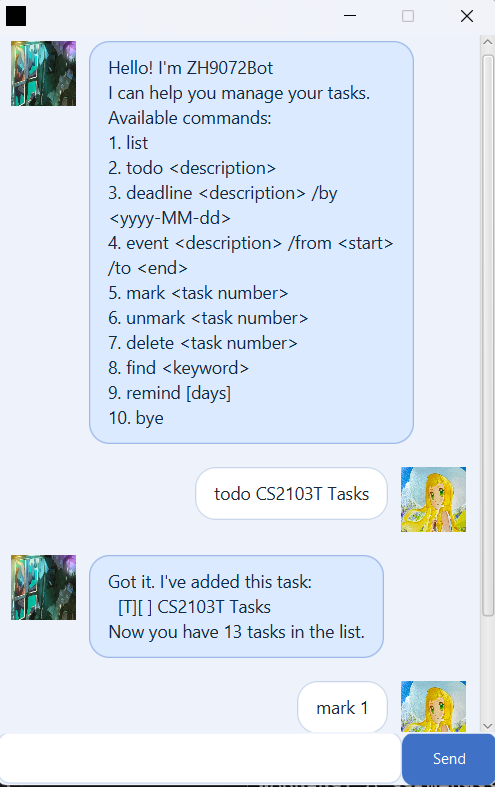

# Zhbot User Guide

Zhbot helps you track tasks with simple text commands.

Above is the current Zhbot GUI. Type your command in the input box and press `Enter` or click `Send`.

## Quick Start

1. Launch the app by running `java -jar Zhbot.jar`.
2. Enter one command per line in the input box.
3. Read the bot response and continue.
4. Use `bye` to exit.

Note:
- In GUI mode, entering `bye` closes the window after a short delay.

## Available Commands

1. `list`  
   Show all tasks.

2. `todo <description>`  
   Add a todo task.  
   Example: `todo clean room`

3. `deadline <description> /by <yyyy-MM-dd>`  
   Add a deadline task with a due date.  
   Example: `deadline submit report /by 2026-02-25`

4. `event <description> /from <start> /to <end>`  
   Add an event task with a start and end.  
   Example: `event project meeting /from 2pm /to 4pm`

5. `mark <task number>`  
   Mark a task as done.  
   Example: `mark 2`

6. `unmark <task number>`  
   Mark a task as not done.  
   Example: `unmark 2`

7. `delete <task number>`  
   Delete a task.  
   Example: `delete 3`

8. `find <keyword>`  
   Find tasks containing a keyword.  
   Example: `find report`

9. `remind` or `remind <days>`  
   Show unfinished upcoming deadlines.  
   Examples: `remind`, `remind 3`

10. `bye`  
    Exit the app.

## Input Rules

- Task numbers are one-based (first task is `1`).
- `deadline` date must use `yyyy-MM-dd`.
- `event` must include both `/from` and `/to`.
- `remind <days>` requires a non-negative whole number.

## Common Error Messages

- `Index must be a number.`
- `Index must be a positive number.`
- `Index is out of range.`
- `Oops - please add some content after 'todo'.`
- `Oops - deadline must have /by yyyy-MM-dd.`
- `Oops - date must be yyyy-MM-dd (e.g., 2019-10-15).`
- `Oops - event must have /from ... /to ...`
- `Oops - please add a keyword after 'find'.`
- `Days must be a non-negative number. Use: remind OR remind <days>.`
- `Sorry, I don't understand your command. Please try again.`
